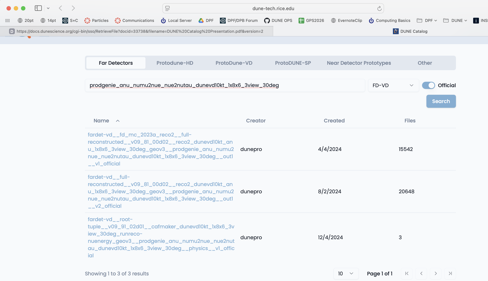
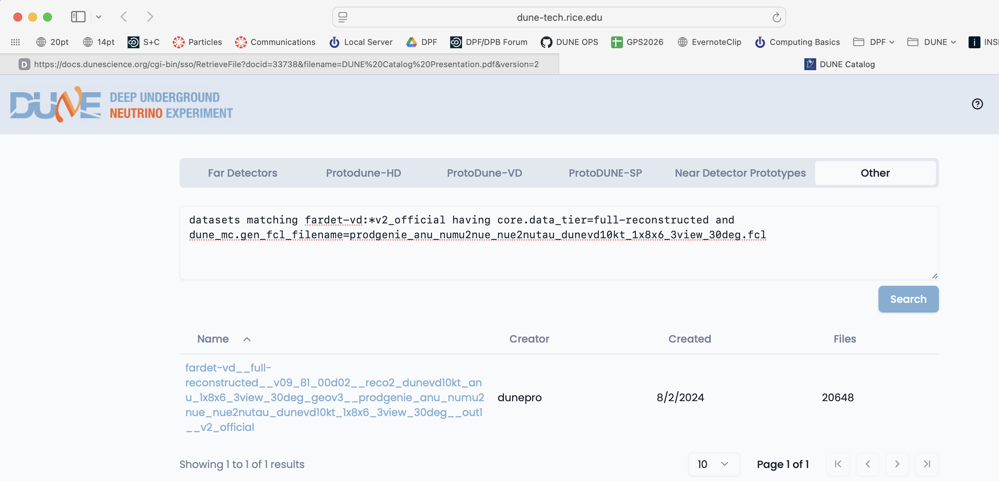



## Session Video

<!--The session will be captured on video a placed here after the workshop for asynchronous study.-->

The session video on December 10, 2024 was captured for your asynchronous review. 

<iframe width="560" height="315" src="https://www.youtube.com/embed/BGDdeflZDUs" title="DUNE Computing Tutorial Dec 2024 Data Management" frameborder="0" allow="accelerometer; autoplay; clipboard-write; encrypted-media; gyroscope; picture-in-picture" allowfullscreen></iframe>

<!--
#### Live Notes

Participants are encouraged to monitor and utilize the [Livedoc for May. 2023](https://docs.google.com/document/d/19XMQqQ0YV2AtR5OdJJkXoDkuRLWv30BnHY9C5N92uYs/edit?usp=sharing) to ask questions and learn.  For reference, the [Livedoc from Jan. 2023](https://docs.google.com/document/d/1sgRQPQn1OCMEUHAk28bTPhZoySdT5NUSDnW07aL-iQU/edit?usp=sharing) is provided.

<!--Temporary Note: The May 2023 version of the DUNE Software and Computing training was imported from the May 2022 version because it was a two day event, similar to this one, see [03-data-management.md (May 2022)](https://github.com/DUNE/computing-training-basics/blob/gh-pages/_episodes/03-data-management.md) for reference.

This lesson (03-data-management.md) was imported from the [Jan. 2023 lesson](https://github.com/DUNE/computing-training-basics-short/tree/gh-pages/_episodes) which was a shortened version of the training.

Quiz blocks are added in this lesson and should be administered in the closing minutes of this lesson. Feel free to modify or add quiz questions. Some of these quiz questions might be more appropriate for 02-storage-spaces.md -->

## Introduction

### What we need to do to produce accurate physics results
DUNE has a lot of data which is processed through a complicated chain of steps. We try to abide by [FAIR](https://www.go-fair.org/fair-principles/) (Findable, Accesible, Intepretable and Reproducible) principles in our use of data.  

Our [DUNE Physics Analysis Review Procedures](https://docs.dunescience.org/cgi-bin/sso/RetrieveFile?docid=28237&filename=physics_analysis_review_v7.pdf) state that:

1. Software must be documented, and committed to a repository accessible to the collaboration.

    The preferred location is any repository managed within the official DUNE GitHub page: https://github.com/DUNE.

    There should be sufficient instructions on how to reproduce the results included with the software. In particular, a good goal is that the working group conveners are able to remake plots, in case cosmetic changes need to be made. Software repositories should adhere to licensing and copyright guidelines detailed in DocDB-27141.

2. **Data and simulation samples must come from well-documented, reproducible production campaigns. For most analyses, input samples should be official, catalogued DUNE productions.**

### How we do it ?

DUNE offical data samples are produced using released code, cataloged with metadata that describes the processing chain and stored so that they are accessible to collaborators.  

DUNE data is stored around the world and you cannot directly log into most of the systems. For this purpose we use the [metacat][metacat] data catalog to describe the data and collections and the [rucio][rucio] file storage system to determine where replicas of files are and provide a url that allows you to process them.  There is also a legacy SAM data access system that can be used for older files. 

There are currently > 27M files cataloged in metacat with a total size of > 48 PB.
   

Key idea:  

- `metacat` tells us *what* the file is and *how* it was made, with what software.  
- `rucio` tells us *where* the file is, and gets it and keeps it where it is supposed to be.

All rucio entries should have a metacat entry describing them. With a few exceptions (retired, intermediate files), metacat entries correspond to real files in rucio.  

### How do I use this. 

If you want to access data, this module will help you find and examine it.

If you want to process data using the full power of DUNE computing, you should talk to the data management group about methods for cataloging any data files you plan to produce.  This will allow you to use DUNE's collaborative storage capabilities to preserve and share your work with others and will be required for publication of results. 

<!-- FIXME - explain the 2 layers, metacat and rucio -->
 
## How to find and access official data



You can also query the catalogs yourself using [metacat][metacat] and [rucio][rucio] catalogs.  Metacat contains information about file content and official datasets, rucio stores the physical location of those files.  Files should have entries in both catalogs.  Generally you ask metacat first to find the files you want and then ask rucio for their location.

## What is metacat?

Metacat is a file and dataset catalog - it allows you to search for files and datasets that have particular attributes and understand their provenance, including details on all of their processing steps. 
It also allows for querying jointly the file catalog and the DUNE conditions database.

You can find extensive documentation on metacat at:

[General metacat documentation](https://metacat.readthedocs.io/en/latest/)

[DUNE metacat examples](https://dune.github.io/DataCatalogDocs/index.html)

### Find a file in metacat

DUNE runs multiple experiments (far detectors, protodune-sp, protodune-dp hd-protodune, vd-protodune, iceberg, coldboxes... ) and produces various kinds of data (mc/detector) and process them through different phases.

To find your data you need to specify at the minimum 

- `core.run_type`  (the experiment:  fardet-vd, hd-protodune ...)
- `core.file_type` (mc or detector)
- `core.data_tier` (the level of processing raw, full-reconstructed, root-tuple ...)

and when searching for specific types of data

- `core.data_stream` (physics, calibration, cosmics)
- `core.runs[any]=<runnumber>`

For processed data you also need to know about

- `core.application.version` (version of code run)
- `dune.config_file` (configuration file for the reconstruction/simulation)
- `dune_mc.gen_fcl_filename` (configuration for the initial simulation physics)
- `dune.output_status` (This should be 'confirmed' for processed files.  If it is not, the file likely never got stored.)
- `core.data_tier` (what kind of output is it?)

### Example of doing a metacat search

 Here is an example of a metacat query that gets you raw files from a recent 'hd-protodune' cosmics run.

Note: there are example setups that do a full setup in the extras folder:

- [SL7 setup]({{ site.baseurl }}/sl7_setup)
- [AL9 setup]({{ site.baseurl }}/al9_setup)

First get metacat if you have not already done so

> ## SL7 
> 
> Make certain you have dune software  set up
> [SL7 setup]({{ site.baseurl }}/sl7_setup)
{: .callout}

> ## AL9
> Make certain you have AL9 set up
> [AL9 setup]({{ site.baseurl }}/al9_setup)
{: .callout}

<!-- > ## For both
> ~~~
> metacat auth login -m password $USER  # use your services password to authenticate
> ~~~
> {: .language-bash}
{: .callout}

>### Note: other means of authentication
>Check out the [metacat documentation](https://metacat.readthedocs.io/en/latest/ui.html#user-authentication) for 
 token authentication. 
{: .callout} -->

### then do queries to find particular groups of files

~~~
metacat query "files from dune:all where core.file_type=detector and core.run_type=hd-protodune and core.data_tier=raw and core.runs[any]=27331 limit 1"
~~~
{: .language-bash}

this should give you a file:

~~~
hd-protodune:np04hd_raw_run027331_0254_dataflow0_datawriter_0_20240620T173408.hdf5
~~~
{: .output}

the string before the ':' is the namespace and the string after is the filename.

You can find out more about your file by doing:

~~~
metacat file show -m -l hd-protodune:np04hd_raw_run027331_0254_dataflow0_datawriter_0_20240620T173408.hdf5
~~~
{: .language-bash}

which gives you a lot of information:

~~~
checksums:
    adler32   : 5222f2ae
created_timestamp   :	2024-06-20 17:38:45.141418+00:00
creator             :	dunepro
fid                 :	83316551
name                :	np04hd_raw_run027331_0254_dataflow0_datawriter_0_20240620T173408.hdf5
namespace           :	hd-protodune
size                :	4238541524
updated_timestamp   :	1718905125.141418
metadata:
    core.data_stream    : physics
    core.data_tier      : raw
    core.end_time       : 1718904863.0
    core.event_count    : 35
    core.events         : [35564, 35568, 35572, 35576, 35580, 35584, 35588, 35592, 35596, 35600, 35604, 35608, 35612, 35616, 35620, 35624, 35628, 35632, 35636, 35640, 35644, 35648, 35652, 35656, 35660, 35664, 35668, 35672, 35676, 35680, 35684, 35688, 35692, 35696, 35700]
    core.file_content_status: good
    core.file_format    : hdf5
    core.file_type      : detector
    core.first_event_number: 35564
    core.last_event_number: 35700
    core.run_type       : hd-protodune
    core.runs           : [27331]
    core.runs_subruns   : [2733100001]
    core.start_time     : 1718904848.0
    dune.daq_test       : False
    retention.class     : physics
    retention.status    : active
children:
   hd-protodune-det-reco:np04hd_run27331_calibana_merged_1.root (cl7b7XQpTpS3PGm5)
   hd-protodune-det-reco:np04hd_raw_run027331_0254_dataflow0_datawriter_0_20240620T173408_reco_stage1_reco_stage2_20240926T225231_keepup_hists.root (Kf6CttcJRJu2uk58)
   hd-protodune-det-reco:np04hd_raw_run027331_0254_dataflow0_datawriter_0_20240620T173408_reco_stage1_reco_stage2_20240926T225231_keepup.root (sxh5FHKLTGym6pDp)
   hd-protodune-det-reco:np04hd_raw_run027331_0254_dataflow0_datawriter_0_20240620T173408_reco_stage1_reco_stage2_20240623T013207_keepup.root (Xl9QXEo0RouAqO0s)
   hd-protodune-det-reco:np04hd_raw_run027331_0254_dataflow0_datawriter_0_20240620T173408_reco_stage1_20240623T013207_keepup_hists.root (xWIH9tmnSWqWBJE5)
~~~
{: .output}   

### What do those fields mean? 

look in the [glossary][MetaCatGlossary] to see what those fields mean. 

> ### Warning - there are multiple child files that look similar
> Files can be reprocessed with different versions and can be reprocessesd twice if the batch system gets confused.  Experts can tell them apart with specific queries about reconstruction versions and file status (in this case there were 2 reconstruction versions core.application.version =  v09_90_02d00
and v09_91_02d01).
>
> **If you are doing real analysis please use the [official datasets](#Official_Datasets) which experts have defined** 
> 
> if no official dataset exists, you need to require additional fields like:
> `dune.output_status=confirmed` and `core.application.version=v09_91_02d01` and `dune.config_file=standard_reco_stage2_calibration_protodunehd_keepup.fcl` to make certain that the job that created the file actually wrote the output back to storage and you are not looking at 2 versions of the same file.
{: .callout}

### find out how much raw data there is in a run using the summary option

~~~
metacat query -s "files from dune:all where core.file_type=detector \
 and core.run_type=hd-protodune and core.data_tier=raw \
 and core.data_stream=physics and core.runs[any]=27331"
~~~
{: .language-bash}

~~~
Files:        4144
Total size:   17553648200600 (17.554 TB)
~~~
{: .output}

<!-- To look at all the files in that run you need to use XRootD - **DO NOT TRY TO COPY 4 TB to your local area!!!*** -->

<!-- ## Official datasets 

The production group make official datasets which are sets of files which share important characteristics such as experiment, data_tier, data_stream, processing version and processing configuration. 

See [DUNE Physics Datasets](https://docs.dunescience.org/cgi-bin/sso/RetrieveFile?docid=29787&filename=DUNEdataset_v1.pdf) for a detailed description. 

### Fast web catalog queries

You can do fast string queries based on keywords embedded in the dataset name.  

Go to [dunecatalog](https://dune-tech.rice.edu/dunecatalog/) and log in with your services password.

Choose your apparatus (Far Detector for example), use the category key to further refine your search and then type in keywords.  Here I chose the `Far Detectors` tab and the `FD-VD` category from the pulldown menu. 

{: .image-with-shadow }

If you click on a dataset you can see a sample of the files inside it. 

You can find a more detailed tutorial for the dunecatalog site at:
[Dune Catalog Tutorial](https://docs.dunescience.org/cgi-bin/sso/RetrieveFile?docid=33738&filename=DUNE%20Catalog%20Presentation.pdf&version=2)

### Command line tools and advanced queries 

You can also explore and find the right dataset on the command line by using metacat dataset keys:

First you need to know your namespace and then explore within it.

~~~
metacat namespace list # find likely namespaces
~~~
{: .language-bash}

There are official looking ones like `hd-protodune-det-reco` and ones for users doing production testing like `schellma`.  The default for general use is `usertests`

Creation of namespaces by non-privileged users is currently disabled. A tool is in progress which will automatically make one namespace for each user

### metacat web interface

Metacat also has a web interface that is useful in exploring file parentage [metacat gui](https://metacat.fnal.gov:9443/dune_meta_prod/app/gui)

### Example of finding reconstructed Monte Carlo

Let's look for some reconstructed Monte Carlo from the VD far detector. 

~~~
metacat query "datasets matching fardet-vd:*official having core.data_tier=full-reconstructed"
~~~
{: .language-bash}

Lots of output ... looks like there are 2 types of official ones - let's get "v2"

~~~
metacat query "datasets matching fardet-vd:*v2_official having core.data_tier=full-reconstructed"
~~~
{: .language-bash}

and there are then several different generators. Let's explore reconstructed simulation of the vertical drift far detector. 

~~~
metacat query "datasets matching fardet-vd:*v2_official having core.data_tier=full-reconstructed and dune_mc.gen_fcl_filename=prodgenie_nu_numu2nue_nue2nutau_dunevd10kt_1x8x6_3view_30deg.fcl"
~~~
{: .language-bash}

Ok, found the official neutrino beam dataset:

~~~
fardet-vd:fardet-vd__full-reconstructed__v09_81_00d02__reco2_dunevd10kt_nu_1x8x6_3view_30deg_geov3__prodgenie_nu_numu2nue_nue2nutau_dunevd10kt_1x8x6_3view_30deg__out1__v2_official
~~~
{: .output}

  
~~~
metacat query "datasets matching fardet-vd:*v2_official having core.data_tier=full-reconstructed and dune_mc.gen_fcl_filename=prodgenie_anu_numu2nue_nue2nutau_dunevd10kt_1x8x6_3view_30deg.fcl"
~~~

And the anti-neutrino dataset:

~~~
fardet-vd:fardet-vd__full-reconstructed__v09_81_00d02__reco2_dunevd10kt_anu_1x8x6_3view_30deg_geov3__prodgenie_anu_numu2nue_nue2nutau_dunevd10kt_1x8x6_3view_30deg__out1__v2_official
~~~
{: .output}

### you can use the web data catalog to do advanced searches

You can also do keyword/value queries like the ones above using the Other tab on the web-based Data Catalog.

{: .image-with-shadow }
 -->

### find out how much data there is in a dataset

Do a query of a dataset using the `-s` or `--summary` option

~~~
metacat query -s "files from fardet-vd:fardet-vd__full-reconstructed__v09_81_00d02__reco2_dunevd10kt_anu_1x8x6_3view_30deg_geov3__prodgenie_anu_numu2nue_nue2nutau_dunevd10kt_1x8x6_3view_30deg__out1__v2_official"
~~~
{: .language-bash}

~~~
Files:        20648
Total size:   34550167782531 (34.550 TB)
~~~
{: .output}

this may take a while as that is a big dataset. 

 
### What describes a dataset?

Let's look at the metadata describing an anti-neutrino dataset: the -j means json output

~~~
metacat dataset show -j fardet-vd:fardet-vd__full-reconstructed__v09_81_00d02__reco2_dunevd10kt_anu_1x8x6_3view_30deg_geov3__prodgenie_anu_numu2nue_nue2nutau_dunevd10kt_1x8x6_3view_30deg__out1__v2_official
~~~
{: .language-bash}

~~~
{
    "created_timestamp": 1722620726.662696,
    "creator": "dunepro",
    "description": "files where namespace='fardet-vd' and core.application.version=v09_81_00d02 and core.application.name=reco2 and core.data_stream=out1 and core.data_tier='full-reconstructed' and core.file_type=mc and core.run_type='fardet-vd' and dune.campaign=fd_mc_2023a_reco2 and dune.config_file=reco2_dunevd10kt_anu_1x8x6_3view_30deg_geov3.fcl and dune.requestid=ritm1780305 and dune_mc.detector_type='fardet-vd' and dune_mc.gen_fcl_filename=prodgenie_anu_numu2nue_nue2nutau_dunevd10kt_1x8x6_3view_30deg.fcl and dune.output_status=confirmed and core.group=dune",
    "file_count": 20648,
    "file_meta_requirements": {},
    "frozen": true,
    "metadata": {
        "core.application.name": "reco2",
        "core.application.version": "v09_81_00d02",
        "core.data_stream": "out1",
        "core.data_tier": "full-reconstructed",
        "core.file_type": "mc",
        "core.group": "dune",
        "core.run_type": "fardet-vd",
        "datasetpar.deftag": "v2_official",
        "datasetpar.max_time": null,
        "datasetpar.min_time": null,
        "datasetpar.namespace": "fardet-vd",
        "dune.campaign": "fd_mc_2023a_reco2",
        "dune.config_file": "reco2_dunevd10kt_anu_1x8x6_3view_30deg_geov3.fcl",
        "dune.output_status": "confirmed",
        "dune.requestid": "ritm1780305",
        "dune_mc.detector_type": "fardet-vd",
        "dune_mc.gen_fcl_filename": "prodgenie_anu_numu2nue_nue2nutau_dunevd10kt_1x8x6_3view_30deg.fcl"
    },
    "monotonic": false,
    "name": "fardet-vd__full-reconstructed__v09_81_00d02__reco2_dunevd10kt_anu_1x8x6_3view_30deg_geov3__prodgenie_anu_numu2nue_nue2nutau_dunevd10kt_1x8x6_3view_30deg__out1__v2_official",
    "namespace": "fardet-vd",
    "updated_by": null,
    "updated_timestamp": null
}
~~~
{: .output}

You can use any of those keys to refine dataset searches as we did above. You probably have to ask your physics group which are interesting. 

### What files are in that dataset and how do I use them?

You can either locate and click on a dataset in the [web data catalog](https://dune-tech.rice.edu/dunecatalog/) or use the[metacat web interface](https://metacat.fnal.gov:9443/dune_meta_prod/app/gui)  or use the command line:

~~~
metacat query  "files from  fardet-vd:fardet-vd__full-reconstructed__v09_81_00d02__reco2_dunevd10kt_anu_1x8x6_3view_30deg_geov3__prodgenie_anu_numu2nue_nue2nutau_dunevd10kt_1x8x6_3view_30deg__out1__v2_official limit 10"
~~~
{: .languate-bash}

will list the first 10 files in that dataset (you probably don't want to list all 20648)

You can also use a similar query in your batch job to get the files you want. 

## Finding those files on disk

To find your files, you need to use [Rucio](#Rucio) directly or give the [justIN](https://dunejustin.fnal.gov/docs/tutorials.dune.md) batch system your query and it will locate them for you. 

<!-- ### What is(was) SAM?  
Sequential Access with Metadata (SAM) is/was a data handling system developed at Fermilab.  It is designed to track locations of files and other file metadata.  It has been replaced by the combination of MetaCat and Rucio.  New files are not getting declared to SAM anymore.  Any SAM locations after June of 2024 should be presumed to be wrong.  Still being used in some legacy ProtoDUNE analyses. -->

<!--This lecture will show you how to access data files that have been defined to the DUNE Data Catalog. Execute the following commands after logging in to the DUNE interactive node, and sourcing the main dune setups.

Once per session:
~~~
setup sam_web_client
export SAM_EXPERIMENT=dune
~~~
-->
## Getting file locations using Rucio

### What is Rucio? 
<!--  -->
Rucio is the next-generation Data Replica service and is part of DUNE's new Distributed Data Management (DDM) system that is currently in deployment. 
Rucio has two functions:
1. A rule-based system to get files to Rucio Storage Elements around the world and keep them there.
2. To return the "nearest" replica of any data file for use either in interactive or batch file use.  It is expected that most DUNE users will not be regularly using direct Rucio commands, but other wrapper scripts that calls them indirectly.

As of the date of the 2025 tutorial:
- The Rucio client is available in CVMFS and Spack
- Most DUNE users are now enabled to use it. New users may not automatically be added. 

### You will need to authenticate to read files

> #### For SL7 use justin to get a token
{:.callout}

<!-- {: .callout} -->

> #### for AL9 use htgettoken to get a token
{:.callout}

<!-- {: .callout} -->

<!-- You need to authenticate to rucio:

~~~
justin time
~~~
{: .language-bash}

The first time it will ask you to open a web browser, authenticate and enter the long string it delivers to you. 

~~~
justin get-token
~~~
{: .language-bash}

~~~
To authorize this computer to run the justin command, visit this page with your
usual web browser and follow the instructions within the next 10 minutes:
https://dunejustin.fnal.gov/authorize/_W_azUJcLhYmAOqClYz9RAsnKbDgzQ6lNA

Check that the Session ID displayed on that page is -cprbbe

Once you've followed the instructions on that web page, you can run the justin
command without needing to authorize this computer again for 7 days.
~~~
{.. .output}

That gave you authorization to use justin. Now do the command again to get an actual token.

~~~
justin get-token
~~~
{.. .language-bash}

You will have to do this sequence weekly as your token expires.  -->

### finding a file

Then use rucio to find out about a file's locations.  the --protocols flag makes certain you get the streaming `root:` location. 

~~~
rucio replica list file fardet-vd:prodmarley_nue_es_flat_radiological_decay0_dunevd10kt_1x8x14_3view_30deg_20250217T033222Z_gen_004122_supernova_g4stage1_g4stage2_detsim_reco.root --pfns --protocols=root
~~~
{: .language-bash}

returns 2 locations:

~~~
root://fndca1.fnal.gov:1094/pnfs/fnal.gov/usr/dune/tape_backed/dunepro//fardet-vd/hit-reconstructed/2025/mc/out1/le_mc_2024a/00/00/51/85/prodmarley_nue_es_flat_radiological_decay0_dunevd10kt_1x8x14_3view_30deg_20250217T033222Z_gen_004122_supernova_g4stage1_g4stage2_detsim_reco.root
root://meitner.tier2.hep.manchester.ac.uk:1094//cephfs/experiments/dune/RSE/fardet-vd/fd/a6/prodmarley_nue_es_flat_radiological_decay0_dunevd10kt_1x8x14_3view_30deg_20250217T033222Z_gen_004122_supernova_g4stage1_g4stage2_detsim_reco.root
~~~
{: .output}

which  the locations of the file on disk and tape. We can use this to copy the file to our local disk or access the file via xroot. 

> ## Testing - access a file
> Try to access the file at manchester using the command:
> ~~~
> root -l root://meitner.tier2.hep.manchester.ac.uk:1094//cephfs/experiments/dune/RSE/fardet-vd/fd/a6/prodmarley_nue_es_flat_radiological_decay0_dunevd10kt_1x8x14_3view_30deg_20250217T033222Z_gen_004122_supernova_g4stage1_g4stage2_detsim_reco.root
> _file0->ls()
> ~~~
> {: .language-bash}
{: .challenge}

It will complain because you haven't loaded all the information needed to read an artroot file but you should be able to read it. 

> ## NOTE if you see a path in `/pnfs/usr/dune/tape_backed` at Fermilab or on `eosctapublic.cern.ch` 
> those are on tape and not generally accessible to the user.  Try to get the file from the remaining one (in this case hep.manchester.ac.uk)
{: .callout}

## More finding files by characteristics using metacat

There isn't always an official dataset so you can also list files directly using metacat.

To list raw data files for a given run:
~~~
metacat query "files where core.file_type=detector \
 and core.run_type='protodune-sp' and core.data_tier=raw \
 and core.data_stream=physics and core.runs[any] in (5141)"
~~~
{: .language-bash}

- `core.run_type` tells you which of the many DAQ's this came from. 
- `core.file_type` tells detector from mc
- `core.data_tier` could be raw, full-reconstructed, root-tuple.  Same data different formats. 

~~~
protodune-sp:np04_raw_run005141_0013_dl7.root
protodune-sp:np04_raw_run005141_0005_dl3.root
protodune-sp:np04_raw_run005141_0003_dl1.root
protodune-sp:np04_raw_run005141_0004_dl7.root
...
protodune-sp:np04_raw_run005141_0009_dl7.root
protodune-sp:np04_raw_run005141_0014_dl11.root
protodune-sp:np04_raw_run005141_0007_dl6.root
protodune-sp:np04_raw_run005141_0011_dl8.root
~~~
{: .output}

Note the presence of both a *namespace* and a *filename* 

What about some files from a reconstructed version?
~~~ 
metacat query "files from dune:all where core.file_type=detector \
 and core.run_type='protodune-sp' and core.data_tier=full-reconstructed  \
 and core.data_stream=physics and core.runs[any] in (5141) and dune.campaign=PDSPProd4 limit 10" 
~~~
{: .language-bash}

~~~
pdsp_det_reco:np04_raw_run005141_0013_dl10_reco1_18127013_0_20210318T104043Z.root
pdsp_det_reco:np04_raw_run005141_0015_dl4_reco1_18126145_0_20210318T101646Z.root
pdsp_det_reco:np04_raw_run005141_0008_dl12_reco1_18127279_0_20210318T104635Z.root
pdsp_det_reco:np04_raw_run005141_0002_dl2_reco1_18126921_0_20210318T103516Z.root
pdsp_det_reco:np04_raw_run005141_0002_dl14_reco1_18126686_0_20210318T102955Z.root
pdsp_det_reco:np04_raw_run005141_0015_dl5_reco1_18126081_0_20210318T122619Z.root
pdsp_det_reco:np04_raw_run005141_0017_dl10_reco1_18126384_0_20210318T102231Z.root
pdsp_det_reco:np04_raw_run005141_0006_dl4_reco1_18127317_0_20210318T104702Z.root
pdsp_det_reco:np04_raw_run005141_0007_dl9_reco1_18126730_0_20210318T102939Z.root
pdsp_det_reco:np04_raw_run005141_0011_dl7_reco1_18127369_0_20210318T104844Z.root
~~~
{: .output}

To see the total number (and size) of files that match a certain query expression, then add the `-s` option to `metacat query`.

<!---`samweb` allows you to select on a lot of parameters which are documented here:

* [Useful ProtoDUNE samweb parameters][useful-samweb]

* [dune-data.fnal.gov](https://dune-data.fnal.gov) lists some official dataset definitions 

-->

See the metacat documentation for more information about queries.  [DataCatalogDocs][DataCatalogDocs]  and check out the glossary of common fields at: [MetaCatGlossary][MetaCatGlossary]

## Accessing data for use in your analysis
To access data without copying it, `XRootD` is the tool to use. However it will work only if the file is staged to the disk.

You can stream files worldwide if you have a DUNE VO certificate as described in the preparation part of this tutorial.

To learn more about using Rucio and Metacat to run over large data samples go here:

> # Full justIN/Rucio/Metacat Tutorial
> The [justIN tutorial](https://dunejustin.fnal.gov/docs/tutorials.dune.md)
>  and [justIN/Rucio/Metacat Tutorial](https://docs.dunescience.org/cgi-bin/sso/RetrieveFile?docid=30145)  
{: .challenge}

> ## Exercise 1
> * Use `metacat query ....` to find a file from a particular experiment/run/processing stage.  Look in [DataCatalogDocs](https://dune.github.io/DataCatalogDocs/index.html) for hints on constructing queries.  
> * Use `metacat file show -m -l namespace:filename` to get  metadata for this file. Note that `--json` gives the output in json format.
{: .challenge}

When we are analyzing large numbers of files in a group of batch jobs, we use a metacat dataset to describe the full set of files that we are going to analyze and use the JustIn system to run over that dataset. Each job will then come up and ask metacat and rucio to give it the next file in the list. It will try to find the nearest copy.  For instance if you are running at CERN and analyzing this file it will automatically take it from the CERN storage space EOS.

> ## Exercise 2  - explore in the gui
> [The Metacat Gui](https://metacat.fnal.gov:9443/dune_meta_prod/app/auth/login) is a nice place to explore the data we have.
> 
> You need to log in with your services (not kerberos) password.
>
> do a datasets search of all namespaces for the word official in a dataset name
> 
> you can then click on sets to see what they contain
{: .challenge}

> ## Exercise 3 - explore a dataset
> Use metacat to find information about the dataset justin-tutorial:justin-tutorial-2024
> How many files are in it, what is the total size.  (metacat dataset show command, and metacat dataset files command)
> Use rucio to find one of the files in it.
{: .challenge}

**Resources**: 

- [DataCatalogDocs][DataCatalogDocs]  
- The [Justin/Rucio/Metacat Tutorial](https://docs.dunescience.org/cgi-bin/sso/RetrieveFile?docid=30145) 
- [justin tutorial](https://dunejustin.fnal.gov/docs/tutorials.dune.md)

## Quiz

> ## Question 01
>
> What is file metadata?
> <ol type="A">
> <li>Information about how and when a file was made</li>
> <li>Information about what type of data the file contains</li>
> <li>Conditions such as liquid argon temperature while the file was being written</li>
> <li>Both A and B</li>
> <li>All of the above</li>
> </ol>
>
> > ## Answer
> > The correct answer is D - Both A and B.
> > {: .output}
> > Comment here
> {: .solution}
{: .challenge}

> ## Question 02
>
> How do we determine a DUNE data file location?
> <ol type="A">
> <li>Do `ls -R` on /pnfs/dune and grep</li>
> <li>Use `rucio replica list file` (namespace:filename) --pnfs --protocols=root</li>
> <li>Ask the data management group</li>
> <li>None of the Above</li>
> </ol>
>
> > ## Answer
> > The correct answer is B - use `rucio replica list file` (namespace:filename).
> > {: .output}
> > Comment here
> {: .solution}
{: .challenge}

## Useful links to bookmark
* DataCatalog: [https://dune.github.io/DataCatalogDocs](https://dune.github.io/DataCatalogDocs/index.html)
* metacat: [https://dune.github.io/DataCatalogDocs/]
* rucio: [https://rucio.github.io/documentation/]
* Pre-2024 Official dataset definitions: [dune-data.fnal.gov](https://dune-data.fnal.gov)
* [UPS reference manual](http://www.fnal.gov/docs/products/ups/ReferenceManual/)
* [UPS documentation (redmine)](https://cdcvs.fnal.gov/redmine/projects/ups/wiki)
* UPS qualifiers: [About Qualifiers (redmine)](https://cdcvs.fnal.gov/redmine/projects/cet-is-public/wiki/AboutQualifiers)
* [mrb reference guide (redmine)](https://cdcvs.fnal.gov/redmine/projects/mrb/wiki/MrbRefereceGuide)
* CVMFS on DUNE wiki: [Access files in CVMFS](https://wiki.dunescience.org/wiki/DUNE_Computing/Access_files_in_CVMFS)

[Ifdh_commands]: https://cdcvs.fnal.gov/redmine/projects/ifdhc/wiki/Ifdh_commands
[xrootd-man-pages]: https://xrootd.slac.stanford.edu/docs.html
[Understanding-storage]: https://cdcvs.fnal.gov/redmine/projects/fife/wiki/Understanding_storage_volumes
[useful-samweb]: https://wiki.dunescience.org/wiki/Useful_ProtoDUNE_samweb_parameters
[dune-data-fnal]: https://dune-data.fnal.gov/
[dune-data-fnal-how-works]: https://dune-data.fnal.gov/tutorial/howitworks.pdf
[sam-data-control]: https://wiki.dunescience.org/wiki/Using_the_SAM_Data_Catalog_to_find_data
[sam-longer]: https://dune.github.io/computing-basics/sam-by-schellman/index.html
[Spack documentation]: https://fifewiki.fnal.gov/wiki/Spack
[DataCatalogDocs]: https://dune.github.io/DataCatalogDocs/index.html
[MetaCatGlossary]: https://dune.github.io/DataCatalogDocs/glossary.html

 

